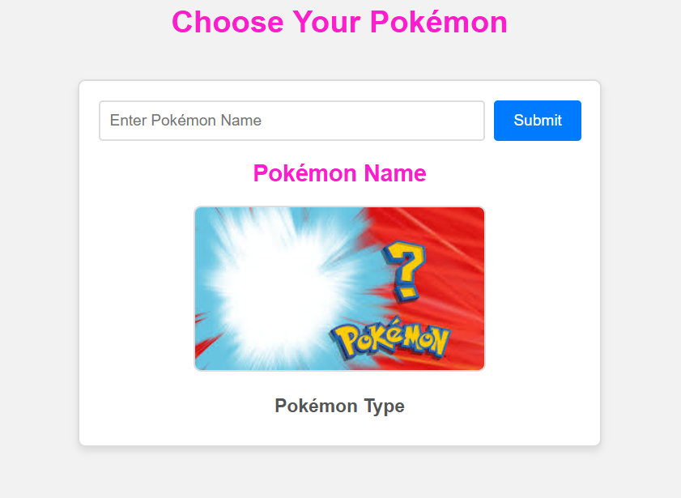
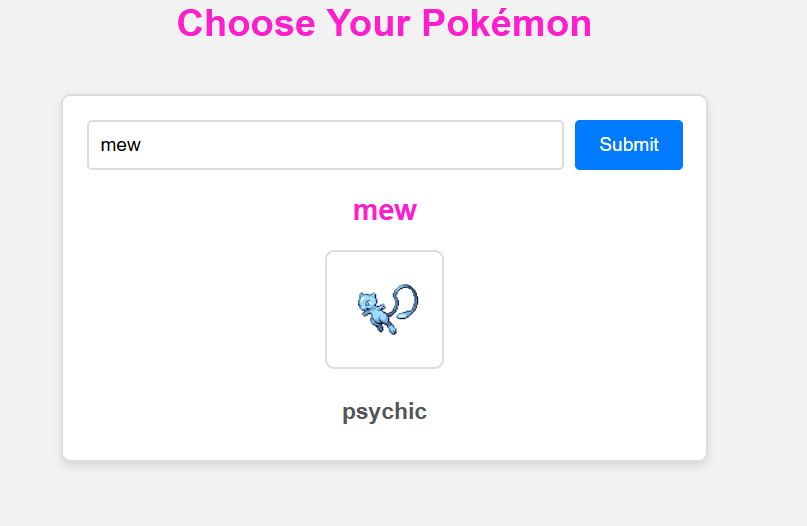

# Simple Pokedex Project

This is a simple Pokedex web application that allows users to search for Pokémon by name and display their details. The app uses the [PokéAPI](https://pokeapi.co/) to fetch Pokémon data, including their name, image, and type.
my first project working with APIs
## Features
- **Search Functionality**: Enter a Pokémon's name to view its details.
- **Dynamic Display**: Shows the Pokémon's name, shiny sprite, and primary type.
- **Responsive Design**: User-friendly and optimized for various screen sizes.

## Technologies Used
- **HTML**: For the structure of the webpage.
- **CSS**: For styling and layout.
- **JavaScript**: For fetching and displaying Pokémon data dynamically.
- **[PokéAPI](https://pokeapi.co/)**: For fetching real-time Pokémon data.

## How It Works
1. Enter the name of a Pokémon in the search bar.
2. Click the "Submit" button.
3. View the Pokémon's shiny sprite, name, and type.

## Demo
  
 

## Getting Started
1. Clone the repository:
   ```bash
   git clone https://github.com/your-username/pokedex-project.git
